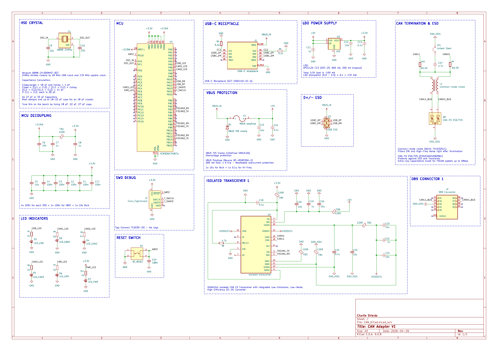
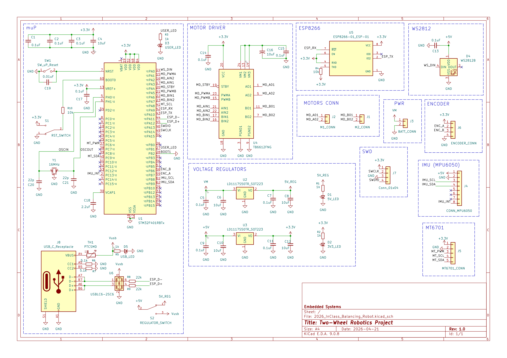
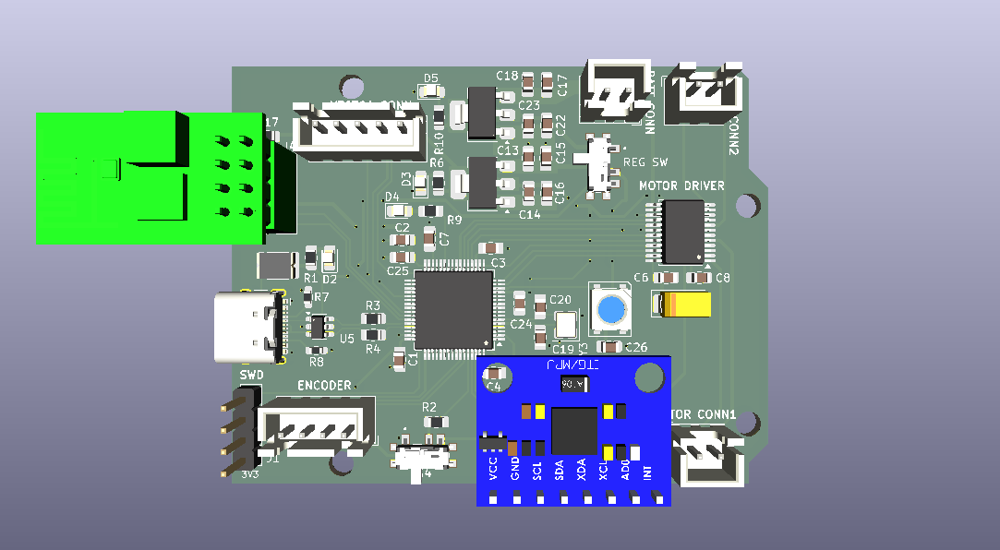
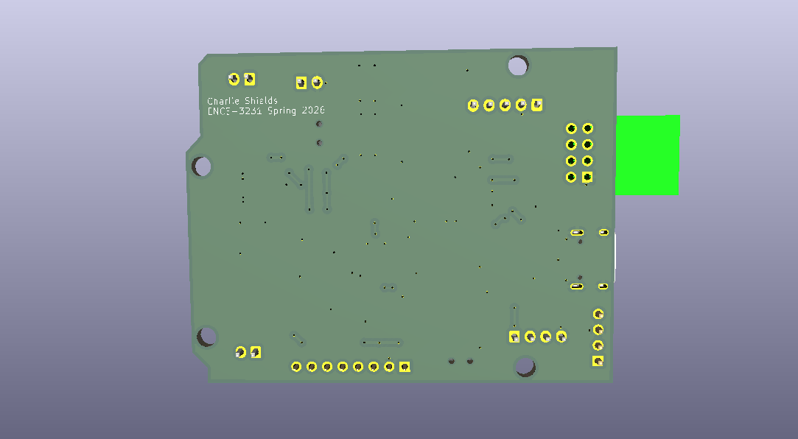

# Embedded Systems Coursework (ENCE 3231)

A small portfolio-style repo of my embedded + hardware design work for class.

## Projects

### 01 — Lab 1: Ultrasonic sensor (timers only)

- **Folder:** `01_lab1_ultrasonic_timers/`
- **What it shows:** timer-driven trigger pulse + measurement cycle; scope + block diagram.
- **Write-up:** `01_lab1_ultrasonic_timers/README.md`

### 02 — CAN board (KiCad)

- **Folder:** `02_can_kicad_board/`
- **What it shows:** CAN interface/board design in KiCad (schematic + PCB).
- **Write-up:** `02_can_kicad_board/README.md`

### 03 — Balancing robot schematic (KiCad)

- **Folder:** `03_balancing_robot_schematic_v1/`
- **What it shows:** system schematic for a 2-wheel balancing robot build.
- **Write-up:** `03_balancing_robot_schematic_v1/README.md`

### 04 — Balancing robot PCB layout (KiCad)

- **Folder:** `04_balancing_robot_pcb_v1/2026_12_2Wheel_Balance_Robot_v1/`
- **What it shows:** PCB layout + 3D renders for the balancing robot.
- **Write-up:** `04_balancing_robot_pcb_v1/README.md`

## Quick open / build

- **KiCad:** open the `*.kicad_pro` file inside a project folder.
- **STM32CubeIDE:** open/import the folder under the lab and build in the IDE (build outputs are ignored).
