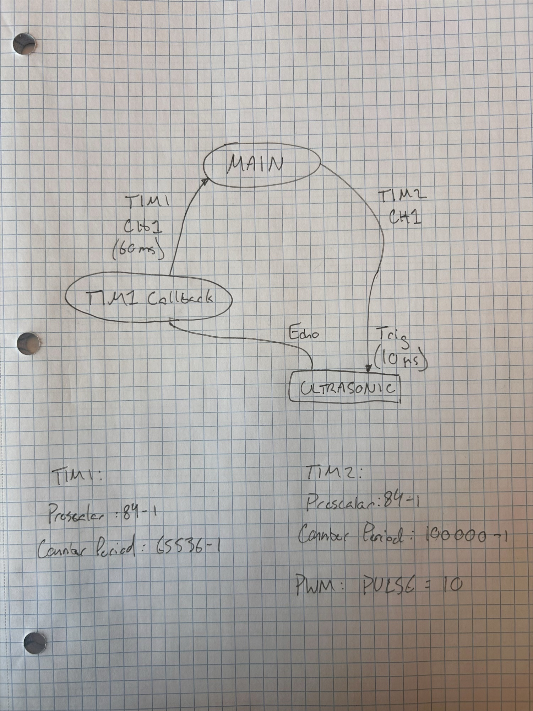

# ENCE 3231: Lab 1: Ultrasonic Sensor with Timers

**Author:** Charlie Shields
**Course:** ENCE 3231: Embedded Systems
**Year:** 2026

## Goal

Interface an HC-SR04 ultrasonic sensor to an STM32 using **only timer functionalities** . The trigger pulse, measurement cycle, and echo capture are all driven by hardware timers and their interrupts. 

## Block Diagram

## Timer Configuration

### TIM1: 60 ms Measurement-Cycle Tick

| Field         | Value      | Reason                                        |
|---------------|------------|-----------------------------------------------|
| Prescaler     | `84 - 1`   | 84 MHz / 84 = 1 MHz (1 µs tick)               |
| Counter Period| `65536 - 1`| ~65.5 ms update event → gates each ping ≥60 ms|
| Mode          | Interrupt  | `HAL_TIM_PeriodElapsedCallback` retriggers TIM2 |

### TIM2: 10 µs TRIG Pulse (PWM, one-shot-style)

| Field         | Value        | Reason                                     |
|---------------|--------------|--------------------------------------------|
| Prescaler     | `84 - 1`     | 1 MHz counter                              |
| Counter Period| `100000 - 1` | 100 ms frame (irrelevant once one-shot)    |
| Channel       | CH1 PWM out  | Drives HC-SR04 `TRIG` pin                  |
| Pulse (CCR1)  | `10`         | 10 counts × 1 µs = **10 µs high time**     |

### Scope Capture: 10 µs TRIG Pulse

Measured on the TIM2 CH1 output pin (PA5).

## What Works

- TIM1 periodic interrupt fires reliably at ~60 ms.
- TIM1 callback kicks off TIM2 PWM, producing a clean 10 µs pulse on TRIG (scope-verified).

## What Doesn't Work Yet

- Echo capture is not implemented.
- Because echo capture is missing, no distance value is computed.
